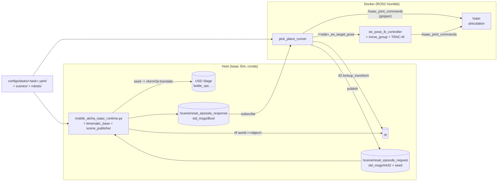

# 18 — 自动 pick & place（先打通自动控制，再谈数采）

这一篇写 RoboTwin 风格的"任务 × 场景 × 机器人 自由组合 + seed 随机化 +
自动 pick&place"在我们这套 Isaac Sim + ROS2 Humble 栈上的落地。

> 文件名虽然叫 `auto_collect_data`，**本轮只做自动控制**，没有引入
> rosbag / HDF5 / LeRobot 任何东西。把"机械臂能在随机物体位置下自己
> 完成抓-放"打通后，下一轮再加录制层即可，schema 已对齐。

写给"过两个月再来看"的自己：先看 §0 架构概览和 §6 一句话备忘，
再按需翻 §1~§5 的细节。

---

## 0. 架构概览



**核心结论**：

- 机械臂 100% 走 ROS2 话题。`pick_place_runner` 跟 SpaceMouse / debug
  teleop / RViz marker 一样发 `/<side>_ee_target_pose`，IK 仍然是
  MoveIt + TRAC-IK；**没有引入 cuRobo，没有走 Isaac Python API
  直控关节**。
- 物体位置不在代码里写死。Isaac 侧的 `mobile_aloha_scene_publisher`
  在每帧把 `world -> bottle / world -> place_zone` 这种 TF 广播出来，
  runner 用 `tf2_ros.Buffer.lookup_transform` 拿位姿。
- seed 化随机由 Isaac 侧完成：用 `random.Random(seed)` 采样，直接改
  `xformOp:translate`，PhysX 用新位姿继续 sim。`/scene/reset_episode_*`
  这一对 topic 让运行期换 seed 重置成为可能。

---

## 1. 与 RoboTwin 2.0 的对齐与差异

| 维度 | RoboTwin 2.0 | 我们的实现 |
| --- | --- | --- |
| IK | cuRobo（GPU） | **MoveIt + TRAC-IK**（CPU，沿用 17 章默认链路） |
| 仿真后端 | SAPIEN | Isaac Sim 5.1 standalone |
| 任务/场景/机器人组合 | `task_config / scene_config / embodiment_config` 三层 yaml | `configs/tasks/ + scenes/ + robots/` 三层 yaml，结构对齐 |
| seed 随机化 | yaml + CLI seed | yaml `seed` + 启动器 `--seed` + 运行期 `/scene/reset_episode_request` |
| 数据采集 | HDF5 + 多视角图像 | **本轮不做**；schema 已留出 `objects[].name` 作为后续标签 |

> RoboTwin 仓库地址：<https://github.com/RoboTwin-Platform/RoboTwin>

---

## 2. 新增 / 修改的文件清单

下面列出本轮所有改动；详细字段表见 §3。

### 新增

| 路径 | 作用 |
| --- | --- |
| `dev_ws/configs/robots/split_aloha_piper.yaml` | embodiment：双臂 / 夹爪关节 / 各自的 target/current/status topic |
| `dev_ws/configs/scenes/aloha_blue_grid.yaml` | 场景：USD 路径 + 期望存在的 prim 列表 |
| `dev_ws/configs/tasks/pick_bottle_right.yaml` | 右臂抓 bottle_xpc 的任务定义 |
| `dev_ws/configs/tasks/pick_bottle_left.yaml` | 镜像版左臂任务，用来验证 `arm: left` 走通 |
| `dev_ws/isaac/scripts/mobile_aloha_scene_publisher.py` | Isaac 侧：seed → USD `xformOp:translate` / 每帧 TF / reset 服务 |
| `dev_ws/isaac/scripts/mobile_aloha_isaac_runtime.py` | Isaac 侧统一 `--exec` 入口（base + scene） |
| `dev_ws/ros2_ws/src/mobile_aloha_isaac_control/mobile_aloha_isaac_control/pick_place_runner.py` | ROS2 侧 runner：读 yaml + tf2 + 状态机 |
| `dev_ws/scripts/run_pick_place_task.sh` | 一键打印（可选执行）两条终端命令的 wrapper |

### 修改

| 路径 | 改动 |
| --- | --- |
| `dev_ws/scripts/run_isaac_mobile_aloha.sh` | 新增 `--task <yaml>` / `--seed <int>`；入口切到 `mobile_aloha_isaac_runtime.py`；不传 `--task` 时退化成只跑底盘 |
| `dev_ws/ros2_ws/src/mobile_aloha_isaac_control/launch/mobile_aloha_control.launch.py` | 新增 `start_pick_place_task / task_config / pick_place_loop / pick_place_reseed_each_episode / pick_place_reset_seed / pick_place_dry_run` 参数；条件性拉起 `pick_place_runner` 节点 |
| `dev_ws/ros2_ws/src/mobile_aloha_isaac_control/setup.py` | 注册 `pick_place_runner` entry point；保留 `right_bottle_pick_place_debug`（标 deprecated） |

---

## 3. yaml schema

### 3.1 robot（embodiment）

`dev_ws/configs/robots/<robot>.yaml`：

| 字段 | 说明 |
| --- | --- |
| `robot` | 唯一名称，task yaml 里用 `robot: <name>` 引用 |
| `robot_prim` | USD 里机器人 prim 的绝对路径 |
| `world_frame` / `base_frame` | tf2 查询时用的世界系和底盘系 |
| `arms.<side>.target_pose_topic` | runner 发 `PoseStamped` 的话题（与 `ee_pose_ik_controller` 对接） |
| `arms.<side>.current_pose_topic` | runner 用来等 EE 反馈的话题 |
| `arms.<side>.gripper_joints` | 一组关节名（mimic 对，比如 `right_joint7/8`） |
| `arms.<side>.gripper_sign` | 与 `gripper_joints` 一一对应的符号；最终命令 = stroke × sign |
| `joint_command_topic` | runner 发夹爪 `JointState` 的话题 |

### 3.2 scene

`dev_ws/configs/scenes/<scene>.yaml`：

| 字段 | 说明 |
| --- | --- |
| `scene` | 唯一名称 |
| `usd_relpath` | 相对项目根（包含 `assets/` 和 `dev_ws/` 那层）的 USD 路径 |
| `world_frame` | 默认 `world` |
| `expected_prims` | 启动时用于 sanity check 的 prim 列表（可选） |

### 3.3 task

`dev_ws/configs/tasks/<task>.yaml`：

| 字段 | 说明 |
| --- | --- |
| `task` | 唯一名称 |
| `scene` / `robot` | 引用 §3.1 / §3.2 中文件名（不含 `.yaml`） |
| `arm` | `left` 或 `right`，决定 runner 命令哪条胳膊 |
| `seed` | 默认 seed；可被启动器 `--seed` 和运行期 reset 消息覆盖 |
| `objects[].name` | 逻辑名；同时也是 TF 子坐标系名 |
| `objects[].prim` | USD prim 路径；省略或 `virtual: true` 表示虚拟点（仅 pose） |
| `objects[].randomize.{x,y,z,yaw}` | 标量 = 固定，`[min,max]` = 均匀采样 |
| `approach.pre_grasp_offset_xyz` | 物体上方安全点偏移 |
| `approach.approach_offset_xyz` | 真正进入抓取前的中转点偏移 |
| `approach.grasp_offset_xyz` | 抓取点相对物体原点的偏移 |
| `approach.lift_height_m` | 抓住后向上提的距离 |
| `approach.place_offset_xyz` | 放置点相对 `place_zone` 原点的偏移 |
| `approach.retreat_offset_xyz` | 放下后撤离的偏移 |
| `approach.target_orientation_wxyz` | 末端目标姿态（四元数 w,x,y,z） |
| `tolerance.pose_tolerance_m` | 距离目标多近算到达 |
| `tolerance.step_timeout_s` | 单步超时；超时后默认 abort，可改 `continue_on_timeout` |
| `gripper.open_m` / `gripper.closed_m` | 夹爪行程（米） |

实例：`dev_ws/configs/tasks/pick_bottle_right.yaml`。

> 状态机展开顺序固定：
> `open → pre-grasp → approach → grasp → close → lift →
> above-place → lower → open-at-place → retreat`。

---

## 4. seed 化随机 + 复位时序

```mermaid
sequenceDiagram
    participant U as User
    participant Bash as run_isaac_mobile_aloha.sh
    participant Isaac as Isaac Sim<br/>(scene_publisher)
    participant Stage as USD Stage
    participant TF as /tf
    participant Run as pick_place_runner

    U->>Bash: --task pick_bottle_right.yaml --seed 42
    Bash->>Isaac: exec runtime.py<br/>MOBILE_ALOHA_TASK_CONFIG=...<br/>MOBILE_ALOHA_TASK_SEED=42
    Isaac->>Stage: rng = Random(42)<br/>bottle_xpc.translate = sample(...)
    Isaac->>TF: world -&gt; bottle (every frame)
    Isaac->>TF: world -&gt; place_zone (every frame)
    Run->>TF: lookup world -&gt; bottle
    Run->>Run: plan steps = bottle_pose + offsets
    Run-->>Isaac: /<side>_ee_target_pose ...<br/>/isaac_joint_commands (gripper)
    Note over Run: episode complete
    Run->>Isaac: /scene/reset_episode_request (seed=N)
    Isaac->>Isaac: timeline.stop()
    Isaac->>Stage: rng = Random(N); rewrite translate
    Isaac->>Isaac: timeline.play()
    Isaac-->>Run: /scene/reset_episode_response (true)
    Run->>Run: re-plan + run again
```

要点：

- **Isaac 在 PhysX 还在 stop 状态时**写 `xformOp:translate`，避免和动力学求解器抢；play 之后 PhysX 用新位姿初始化。
- **seed 来源优先级**：`MOBILE_ALOHA_TASK_SEED` 环境变量 > task yaml 里的 `seed`。runner 在 loop 模式下生成的 reset seed 走 `/scene/reset_episode_request` 直接覆盖。
- 运行期 reset 不重启 Isaac、不重新 load USD，只是 stop + 改 translate + play。

---

## 5. 用户使用方式

### 5.1 单次自动 pick-place（默认 seed 来自 yaml）

终端 A（宿主机）：

```bash
cd ~/dataset/isaac-sim
./dev_ws/scripts/run_isaac_mobile_aloha.sh \
    --task dev_ws/configs/tasks/pick_bottle_right.yaml --seed 42
```

终端 B（docker）：

```bash
cd ~/dataset/isaac-sim
./dev_ws/scripts/run_ros2_humble_docker.sh --build --launch-control -- \
    start_debug_teleop:=false \
    start_pick_place_task:=true \
    task_config:=/workspace/dev_ws/configs/tasks/pick_bottle_right.yaml
```

第一次或者改了 launch / config 时加 `--build`；之后纯 Python 改动可以省。

### 5.2 连续 N 个 episode（每次换 seed 自动 reset）

终端 B 改成：

```bash
./dev_ws/scripts/run_ros2_humble_docker.sh --launch-control -- \
    start_debug_teleop:=false \
    start_pick_place_task:=true \
    task_config:=/workspace/dev_ws/configs/tasks/pick_bottle_right.yaml \
    pick_place_loop:=true \
    pick_place_reseed_each_episode:=true
```

终端 A 不变。runner 完成一轮后会发 `/scene/reset_episode_request`，
Isaac 那侧 stop → 新 seed 改 translate → play，runner 收到
`/scene/reset_episode_response` 后开始下一轮。Ctrl-C runner 退出循环。

### 5.3 切左臂

终端 A `--task dev_ws/configs/tasks/pick_bottle_left.yaml`，
终端 B 把 `task_config:=` 同步改成对应 yaml，其他不变。

### 5.4 让某个步骤"先看看会发什么"

终端 B 加 `pick_place_dry_run:=true`，runner 会算所有目标点和夹爪命令
但不真的发布；用来验证 yaml 写得对不对。

### 5.5 退化用法（不开任务，只想要原来那套）

终端 A 不传 `--task`：跟以前一样，只起底盘 ROS 节点。终端 B 不传
`start_pick_place_task:=true`：跟以前一样，只起 IK / teleop / RViz。

---

## 6. 一句话备忘

```bash
# Terminal A
./dev_ws/scripts/run_isaac_mobile_aloha.sh \
    --task dev_ws/configs/tasks/pick_bottle_right.yaml --seed 42

# Terminal B
./dev_ws/scripts/run_ros2_humble_docker.sh --build --launch-control -- \
    start_debug_teleop:=false \
    start_pick_place_task:=true \
    task_config:=/workspace/dev_ws/configs/tasks/pick_bottle_right.yaml
```

或者：

```bash
./dev_ws/scripts/run_pick_place_task.sh --task pick_bottle_right --seed 42
```

会把上面两条命令直接 echo 出来。

---

## 7. 常见踩坑

| 现象 | 原因 / 排查 |
| --- | --- |
| runner 一直打 `Waiting for /tf world -> (bottle, place_zone)` | Isaac 没传 `--task`，scene publisher 没起。检查 Isaac 启动日志里是否有 `TaskScenePublisher loaded task=...` |
| runner 打 `Waiting for current TCP feedback on /<side>_ee_current_pose_in_world` | Isaac 还没 Play，或者 TF `world -> base_link` 没出来。回 17 章 §5 跑 `ros2 topic echo /tf --once`，确认 `world -> base_link` 存在 |
| 物体位置看着没动 | 1) Isaac 要先 Play 才能让 PhysX 接管 translate（实际我们在 stop 状态写、play 时初始化位姿，所以建议每次启动先 Stop 再 Play 一次）；2) yaml 的 `objects[].prim` 路径写错；3) 同一个 USD 没重新打开（如果你自己拖动过 bottle，stage 里的本地编辑会覆盖我们的写） |
| `ik_failed` / 长时间不动 | 抽样到的 grasp 点超出工作空间。把 `objects[].randomize.{x,y}` 收紧，或者调 `approach.target_orientation_wxyz` |
| 左臂任务长时间 `ik_failed` | `pick_bottle_left.yaml` 里的 Y 范围是基于"机器人在世界 Y≈-0.862"的镜像估算，不一定完全准。先用 SpaceMouse / RViz marker 找一个左臂确实可达的点，再回头收紧 yaml 里的 randomize 范围 |
| Reset 之后瓶子飞走 / 弹起 | PhysX 在 play 时拿到一个 penetrate 的初始位姿。把 `objects[].randomize.z` 拉高 1~2cm 让物体先落到桌面 |
| Reset 一直没回 `/scene/reset_episode_response` | scene publisher 没收到请求；确认两侧 RMW 一致（默认 `rmw_cyclonedds_cpp`），用 `ros2 topic echo /scene/reset_episode_request` 看请求是否在 docker 里出现 |
| runner 收到 reset 响应但下一轮还是用老的 bottle 位置 | TF 缓存里有旧值。runner 调 `tf2.lookup_transform(time=0)` 拿最新的 → 一般无问题；但如果你把 `cache_time` 改小过会触发。重启 runner 即可 |

---

## 8. 后续 TODO（不在本轮）

1. **数据采集层**：在 `pick_place_runner` 完成一个 episode 时同步 dump
   `images/` + `joint_states/` + `tcp_pose/` 到 HDF5（或 LeRobot 格式）。
   schema 里 `objects[].name` 已经预留作为标签。
2. **任务扩展**：再加几个任务（双臂协作、塞抽屉、杯子叠杯）。
   schema 上不需要改，新建 yaml + 必要时新增 USD prim 即可。
3. **并行采样**：跑多 Isaac 进程 + 不同 `ROS_DOMAIN_ID`，每个跑一份
   pick_place_runner，按 worker_id 派发 seed。
4. **成功判定**：现在 runner 只看 TCP 是否到位 + 步骤超时；后续需要
   通过抓爪 contact / 物体最终位姿来判 episode 是否真"成功"。
5. **接 VLA 推理**：把 runner 的目标点来源从 yaml 改为外部 policy
   server，做 closed-loop eval。
