# 19 — 视频 → USD 场景：从一段手机视频到 Isaac Sim 5.1.0 可用资产

这一篇打通"绕着场景拍一段视频 → 一条命令产出可以直接 `--task` 加载的
`.usda` 文件 + scene yaml"。

> 写给"过两个月再来用"的自己：先看 §0 架构概览和 §8 一句话备忘，
> 真要拍视频之前先翻 §4 拍摄要点，否则重建出来肯定糊。
>
> **本轮只做静态环境/物体的几何 + 贴图重建**，不解决：
>
> - 透明 / 镜面 / 高反光物体（NeRF / 3DGS 一律糊）
> - 关节物体（抽屉、门、铰链）的 articulation 建模
> - 物理材料参数（摩擦、密度）：默认给 0.5 / 1000，要用就回 13 章手调
>
> 这些是 §6 的"重建后必做手动检查"。

---

## 0. 架构概览

```mermaid
flowchart LR
    Vid[("video.mp4<br/>手机绕场一圈")] --> FF[ffmpeg<br/>抽帧 1-2 fps]
    FF --> Frames[("data/&lt;name&gt;/images/")]
    Frames --> COLMAP[COLMAP<br/>SfM + 稀疏点云]
    COLMAP --> Tform[("transforms.json<br/>+ sparse/")]

    Tform --> NerfTrain[ns-train nerfacto<br/>30k iters / GPU]
    NerfTrain --> Ckpt[("runs/&lt;name&gt;/.../config.yml")]
    Ckpt --> Export[ns-export poisson<br/>500k 点 + 法向]
    Export --> Mesh[("export/&lt;name&gt;/<br/>poisson_mesh.obj + .mtl + tex")]

    subgraph IsaacPy["Isaac Sim 标准 Python (SimulationApp headless)"]
        Mesh --> Conv[omni.kit.asset_converter<br/>OBJ → USDA]
        Conv --> Wrap[pxr 包一层<br/>/World/&lt;name&gt;<br/>+ UsdPhysicsCollisionAPI]
        Wrap --> Out[("assets/&lt;name&gt;.usda")]
    end

    Out --> SceneYaml[("dev_ws/configs/scenes/&lt;name&gt;.yaml<br/>(脚本自动生成)")]
    SceneYaml --> Task["18 章 task yaml<br/>scene: &lt;name&gt;"]
```



**核心结论**：

- 两层依赖：宿主机 conda 装 nerfstudio（含 ffmpeg / COLMAP），
  Isaac Sim 5.1 自带 `omni.kit.asset_converter`。**不引入任何新的
  Docker，不污染 18 章已有链路**。
- 几何走 **NeRF (nerfacto) + Poisson 重建**，不直接用 3DGS。
  3DGS 视觉好但导出 mesh 需要再装 SuGaR/2DGS，且对碰撞计算不友好；
  对 Isaac Sim 的物理需求来说 Poisson mesh 已经够用。3DGS 路径作为
  可选项放在 §3.4。
- 转 USD 的最后一公里**必须在 Isaac Sim 进程里跑**，因为
  `omni.kit.asset_converter` 是 Kit 扩展，不是纯 Python 包。
- 输出按 18 章 §3.2 的 `scene` schema 自动写
  `dev_ws/configs/scenes/<name>.yaml`，新场景**不改任何代码**就能被
  `--task` 复用。

---

## 1. 三条路径对比

| 路径 | 复杂度 | 视觉质量 | 几何/碰撞 | 适用场景 |
| --- | --- | --- | --- | --- |
| **A. 手机 App 直出**（Polycam / Luma / Scaniverse / RealityScan） | ★ | ★★★ | ★★ | 单个物体、桌面级。导出 GLB / OBJ，跳过 §3 直接走 §3.5 |
| **B. nerfstudio 全流程**（推荐） | ★★ | ★★★★ | ★★★ | 整个房间 / 工作台。开源、可重复、命令行 |
| **C. DIY: COLMAP + 3DGS + SuGaR** | ★★★★ | ★★★★★ | ★★ | 想要发表级视觉效果，或者 nerfstudio 出图糊 |

> 默认走 **B**。**A** 用来快速验证管线（5 分钟搞定，跳到 §3.5）。
> **C** 等 B 的输出真的不能用了再上。

---

## 2. 前置依赖

### 2.1 宿主机（一次性）

```bash
# 系统级
sudo apt install -y ffmpeg colmap

# Conda 环境（独立，别污染 Isaac Sim base 的 conda）
conda create -n nerfstudio python=3.10 -y
conda activate nerfstudio
pip install --upgrade pip

# 装 nerfstudio（自带 splatfacto / nerfacto / 训练 + 导出工具）
pip install nerfstudio

# 验证
ns-process-data --help
ns-train --help
ns-export --help
```

> nerfstudio 会拉一份 PyTorch + tinycudann。装完一次，后续直接 `conda activate nerfstudio` 即可。
> COLMAP 在 Ubuntu 22.04 上 apt 装的版本够用；如果 SfM 一直对不齐，再换
> [`glomap`](https://github.com/colmap/glomap)（更稳，速度更快）。

### 2.2 Isaac Sim 侧

无需额外装东西。`omni.kit.asset_converter` 已经在
`isaac-sim-standalone-5.1.0-linux-x86_64/extscache/` 里。
`dev_ws/scripts/video_to_usd_isaac.py`
直接通过 `SimulationApp(headless=True)` 拉起 Isaac Sim 内核就能调它。

---

## 3. 推荐路径：nerfstudio 全流程

下面所有命令假设：

```bash
cd ~/dataset/isaac-sim
conda activate nerfstudio
NAME=workbench_v1                       # 场景名，做主键
WORK=dev_ws/scratch/scenes/${NAME}      # 中间产物
mkdir -p ${WORK}
```

### 3.1 抽帧 + SfM（一步到位）

`ns-process-data video` 内部已经把 ffmpeg 抽帧 + COLMAP SfM 串好了：

```bash
ns-process-data video \
  --data path/to/video.mp4 \
  --output-dir ${WORK}/data \
  --num-frames-target 200
```

输出：

```
${WORK}/data/
  images/                      # 抽帧后的 JPG
  transforms.json              # 每帧的相机内参 + 外参（NeRF 训练需要）
  colmap/sparse/0/             # SfM 稀疏点云
```

> `--num-frames-target` 决定抽多少帧。**经验**：一段 30 秒、缓慢绕场
> 一圈的 1080p 视频，200 帧足够。视频太短抽不出 200 帧，这个数字会
> 自动收缩，不用手动调。
>
> 如果 `transforms.json` 里 `num_matched_frames < 0.7 * num_frames`，
> 说明 COLMAP 没对齐多少帧 → 重拍（见 §4），或者换 GLOMAP。

### 3.2 训练 nerfacto

```bash
ns-train nerfacto \
  --data ${WORK}/data \
  --output-dir ${WORK}/runs \
  --max-num-iterations 30000 \
  --pipeline.model.predict-normals True \
  --viewer.quit-on-train-completion True
```

要点：

- **必须打开** `predict-normals True`，否则 §3.3 的 Poisson 重建拿不到法向，输出 mesh 会破洞。
- `--viewer.quit-on-train-completion True` 训练完自动退出，不开浏览器，
  适合 SSH / 无头机器。本地玩可以去掉这个，用 `http://localhost:7007` 看进度。
- 30k 步在 RTX 4090 上 ≈ 8 分钟，3090 ≈ 12 分钟。糊就翻倍。

训练完拿到：

```
${WORK}/runs/${NAME}/nerfacto/<timestamp>/config.yml
${WORK}/runs/${NAME}/nerfacto/<timestamp>/nerfstudio_models/step-000029999.ckpt
```

`config.yml` 是后续 export 的入口。

### 3.3 导出 mesh（Poisson + 贴图）

```bash
CFG=$(ls -dt ${WORK}/runs/${NAME}/nerfacto/*/config.yml | head -1)

ns-export poisson \
  --load-config ${CFG} \
  --output-dir ${WORK}/export \
  --target-num-faces 200000 \
  --num-pixels-per-side 2048 \
  --num-points 1000000 \
  --remove-outliers True \
  --normal-method open3d
```

输出（重点关注前两个）：

```
${WORK}/export/
  poisson_mesh.obj
  poisson_mesh.mtl
  material_0.png        # baked albedo 贴图
  point_cloud.ply
```

参数说明：

| 参数 | 作用 |
| --- | --- |
| `--target-num-faces` | 目标三角面数。20w 对 Isaac Sim 物理够用且不卡。要求"看着精致"再调到 50w，但碰撞计算开销线性涨。 |
| `--num-pixels-per-side` | baked 贴图分辨率。2048 在文件大小和清晰度上较平衡；要 8K 改 8192，文件涨 16 倍。 |
| `--num-points` | Poisson 输入点数。100w 是 nerfstudio 默认 sweet spot。 |
| `--remove-outliers` | 砍掉空中飘浮的伪影点。**别关**。 |

### 3.4 可选：3DGS 高保真路径

视觉糊得受不了，再考虑这条。**默认不要走**。

```bash
# 训练 3DGS
ns-train splatfacto \
  --data ${WORK}/data \
  --output-dir ${WORK}/runs \
  --max-num-iterations 30000

# 导出原始 .ply（一堆高斯椭球，不是 mesh）
CFG=$(ls -dt ${WORK}/runs/${NAME}/splatfacto/*/config.yml | head -1)
ns-export gaussian-splat --load-config ${CFG} --output-dir ${WORK}/export_gs
```

要把 3DGS 转成 mesh 再喂 §3.5，需要装额外仓库（任选其一）：

- [SuGaR](https://github.com/Anttwo/SuGaR)：mesh 质量较好，要装 PyTorch3D
- [2DGS / GOF](https://github.com/hbb1/2d-gaussian-splatting)：训练阶段就给 mesh 友好版本，需要重训

**Isaac Sim 5.1 渲染端**已经有 `OmniGS` 实验扩展能直接吃 `.ply` 高斯，
但目前**只能渲染、不能做物理**，所以场景里依然得有一份 mesh 用于碰撞。

### 3.5 转 USDA + 加碰撞体（核心步骤）

这一步在 Isaac Sim 标准 Python 进程里跑。脚本见
`dev_ws/scripts/video_to_usd_isaac.py`，单独使用：

```bash
./isaac-sim-standalone-5.1.0-linux-x86_64/python.sh \
  dev_ws/scripts/video_to_usd_isaac.py \
    --input  ${WORK}/export/poisson_mesh.obj \
    --output assets/${NAME}.usda \
    --prim-name ${NAME} \
    --collision-approximation meshSimplification \
    --scale 1.0
```

它内部做三件事：

1. `omni.kit.asset_converter` 把 OBJ + 贴图转成一份带 UsdPreviewSurface 的临时 USDA。
2. 用 `pxr` 把内容包到 `/World/${NAME}` 下面，加 `xformOp:translate`/`orient`/`scale`，方便后续随机化（与 18 章 `objects[].randomize` 对齐）。
3. 给所有 mesh prim 打 `UsdPhysicsCollisionAPI` + `MeshCollisionAPI`。
   `--collision-approximation` 取值：

   | 值 | 适用 |
   | --- | --- |
   | `none` | 直接三角网格碰撞，**只能给静态环境**（地面、墙、桌子整体） |
   | `meshSimplification` | 默认。简化三角网作为静态碰撞 |
   | `convexDecomposition` | 拆成多个凸包，**可动物体（瓶、杯）必须用**；最贵 |
   | `convexHull` | 单一凸包，最便宜，圆滚物体（球）够用 |

   不知道选啥就先 `meshSimplification`，除非这个物体后续要被抓。

### 3.6 自动写 scene yaml

`video_to_usd.sh`（§5）会根据 `--name ${NAME}` 自动写一份
`dev_ws/configs/scenes/${NAME}.yaml`：

```yaml
scene: workbench_v1
description: "Auto-generated from video by 19_scene.md pipeline."
usd_relpath: assets/workbench_v1.usda
world_frame: world
expected_prims:
  - /World/workbench_v1
```

字段语义跟 18 章 §3.2 完全一致，下游 task yaml 直接 `scene: workbench_v1` 就能引用。

---

## 4. 拍视频要点（决定下游所有质量）

> 下面这一坨是踩坑总结，**重要程度 > 下面所有调参**。重建糊 90% 是
> 视频拍得不对。

| 类别 | 做 | 不做 |
| --- | --- | --- |
| 路径 | 绕场地外圈 1 ~ 2 圈，相机始终对着场景中心；中段加 1 圈高度 | 站着不动只转身（视差不够，COLMAP 死活对不齐） |
| 速度 | 慢，**走路一半的速度**，30 ~ 60 秒拍完 | 快速挥扫（运动模糊） |
| 高度 | 至少两个高度：齐桌面 + 站立俯视 | 单一高度 |
| 重叠 | 相邻帧 70% ~ 80% 重叠 | <50% 重叠 |
| 光照 | 均匀漫射、白光，**关闭点光源直射** | 强反差、阴影边缘穿过物体 |
| 物体 | 哑光、有纹理（书本、纸盒、布） | 玻璃、金属、纯色塑料、半透明 |
| 背景 | 静态 | 风吹的窗帘、走过的人 |
| 设备 | 普通手机 1080p / 4K 30 fps；自动曝光锁定 | HDR 模式（曝光跳变）、超广角畸变（如果一定要用，让 COLMAP 解 OPENCV_FISHEYE） |
| 时长 | 30 ~ 90 秒 | <15 秒（帧数不够）；>3 分钟（COLMAP 内存爆） |

视频拍完先肉眼过一遍：**任何 0.5 秒以上的运动模糊片段直接剪掉再喂**。

---

## 5. 一键脚本：`video_to_usd.sh`

把上面 §3.1 ~ §3.6 串起来：

```bash
./dev_ws/scripts/video_to_usd.sh \
  --video path/to/video.mp4 \
  --name  workbench_v1
```

脚本流程（伪代码，对应 §3.1 ~ §3.6）：

1. `conda activate nerfstudio`（如果当前环境不对，自动切换或报错退出）
2. `ns-process-data video` → `${WORK}/data/`
3. `ns-train nerfacto` → `${WORK}/runs/`
4. `ns-export poisson` → `${WORK}/export/poisson_mesh.obj`
5. 切回 base，调用 `isaac-sim.sh --no-window --exec dev_ws/scripts/video_to_usd_isaac.py ...` 把 OBJ 转 USDA → `assets/${NAME}.usda`
6. 写 `dev_ws/configs/scenes/${NAME}.yaml`

支持断点续跑：

```bash
# 已经抽过帧 + SfM，跳过 §3.1
./dev_ws/scripts/video_to_usd.sh --name workbench_v1 --skip-process

# 训练完不想重训，只重新导出 + 转 USD
./dev_ws/scripts/video_to_usd.sh --name workbench_v1 --skip-process --skip-train

# 只跑最后 USD 转换（mesh 已存在）
./dev_ws/scripts/video_to_usd.sh --name workbench_v1 --skip-process --skip-train --skip-export
```

完整参数：

| flag | 默认 | 说明 |
| --- | --- | --- |
| `--video <path>` | — | 输入视频。`--skip-process` 时可省。 |
| `--name <id>` | — | 场景 id。也是输出 USDA / scene yaml 的 stem。 |
| `--method nerfacto\|splatfacto` | `nerfacto` | splatfacto 走 §3.4 路径，不导 mesh，留给后续。 |
| `--num-frames <int>` | 200 | 传给 `ns-process-data`。 |
| `--iters <int>` | 30000 | 传给 `ns-train`。 |
| `--target-faces <int>` | 200000 | 传给 `ns-export poisson`。 |
| `--collision-approximation <str>` | `meshSimplification` | 传给 `video_to_usd_isaac.py`。 |
| `--skip-process / --skip-train / --skip-export / --skip-usd` | — | 断点续跑。 |
| `--workdir <path>` | `dev_ws/scratch/scenes/<name>` | 中间产物。 |
| `--output-usd <path>` | `assets/<name>.usda` | 最终 USDA。 |
| `--no-write-scene-yaml` | — | 不要自动写 `configs/scenes/<name>.yaml`。 |

---

## 6. 重建后必做的手动检查（在 Isaac Sim GUI 里）

`assets/<name>.usda` 拿到手第一件事**用 GUI 打开**（不是 launcher 直接 Play）：

```bash
./isaac-sim-standalone-5.1.0-linux-x86_64/isaac-sim.sh
# File → Open → assets/<name>.usda
```

逐项检查：

1. **Up axis**。脚本默认输出 Z-up。如果场景倒了，菜单
   `Window → Stage` 里看 stage metadata 的 `upAxis`，或
   重新跑脚本时加 `--up-axis Y`。
2. **比例**。COLMAP 重建出来是**任意尺度**的，nerfstudio 默认会把
   场景塞进 [-1, 1] 立方体。`video_to_usd.sh` 会尝试用相机基线估算
   一个粗略 scale，但**不准**。在 Isaac Sim 里量一下场景里某个已知
   尺寸物体（A4 纸 0.297m 等），算出比例，重新跑脚本时传
   `--scale <ratio>` 修正。
3. **碰撞体**。`Physics → Show Colliders` 看绿色 wireframe 是否覆盖
   实体表面。空腔 / 飞片 → 删掉对应 mesh prim 重导。
4. **法向**。如果某些面看着全黑 → 法向反了。脚本里已经
   `predict-normals=True`，糟糕的话改 `--normal-method open3d` 再导。
5. **关节物体**。抽屉、门只会被重建成静态 mesh。要做 articulation：
   - 在 Blender 里把抽屉切成单独 mesh，分别导出 OBJ
   - 在 Isaac Sim 里手动建 PhysicsRevoluteJoint / PrismaticJoint
   - 暂时先放着、用静态 mesh 也能跑 18 章 pick-place
6. **物理材料**。重建出来的 mesh 默认 friction=0.5、density=1000。
   要调回 13 章 §3 的姿势：`UsdPhysics.MaterialAPI.Apply(...)`。

---

## 7. 接 18 章 task：写一个 task yaml

假设 §5 跑完，得到了 `assets/workbench_v1.usda` 和
`dev_ws/configs/scenes/workbench_v1.yaml`。
现在想在这个新场景里抓桌上的物体，照 18 章 §3.3 写一个 task yaml：

```yaml
task: pick_book_on_workbench
scene: workbench_v1            # 引用 §3.6 自动生成的 scene
robot: split_aloha_piper
arm: right
seed: 7

objects:
  - name: book
    prim: /World/workbench_v1/Mesh_book   # 在 GUI 里挑的子 prim
    randomize:
      x: [0.40, 0.55]
      y: [-0.10, 0.10]
      z: 0.78
      yaw: [-0.3, 0.3]
  - name: place_zone
    virtual: true
    randomize:
      x: 0.60
      y: -0.20
      z: 0.78

approach:
  pre_grasp_offset_xyz: [0.0, 0.0, 0.10]
  approach_offset_xyz:  [0.0, 0.0, 0.02]
  grasp_offset_xyz:     [0.0, 0.0, 0.00]
  lift_height_m:        0.15
  place_offset_xyz:     [0.0, 0.0, 0.05]
  retreat_offset_xyz:   [0.0, 0.0, 0.10]
  target_orientation_wxyz: [0.0, 1.0, 0.0, 0.0]

tolerance:
  pose_tolerance_m: 0.02
  step_timeout_s:   8.0

gripper:
  open_m:   0.06
  closed_m: 0.005
```

启动跟 18 章一模一样：

```bash
# 终端 A
./dev_ws/scripts/run_isaac_mobile_aloha.sh \
    --task dev_ws/configs/tasks/pick_book_on_workbench.yaml --seed 7

# 终端 B
./dev_ws/scripts/run_pick_place_task.sh --task pick_book_on_workbench --seed 7 --run-isaac
```

---

## 8. 一句话备忘

```bash
# 一次性环境
conda create -n nerfstudio python=3.10 -y && conda activate nerfstudio && pip install nerfstudio
sudo apt install -y ffmpeg colmap

# 一段视频 → 一份可用 USDA + scene yaml
./dev_ws/scripts/video_to_usd.sh --video path/to/video.mp4 --name workbench_v1

# 不放心就 GUI 打开
./isaac-sim-standalone-5.1.0-linux-x86_64/isaac-sim.sh
# File → Open → assets/workbench_v1.usda
# 检查 §6 那 6 项

# 复用到 18 章 task：写 dev_ws/configs/tasks/<x>.yaml，scene: workbench_v1
```

---

## 9. 常见踩坑

| 现象 | 原因 / 排查 |
| --- | --- |
| `ns-process-data` 报 `COLMAP failed: not enough features` | 视频太晃 / 全是纯色背景。回 §4 重拍。或者把 `--num-frames-target` 拉到 400 让 SfM 多点候选。 |
| `transforms.json` 里 `num_matched_frames` 远小于总帧数 | SfM 只对齐了一半。换 `glomap`：`pip install glomap` 然后 `ns-process-data video --sfm-tool glomap ...`。 |
| nerfacto loss 一直在 0.05+ 下不去 | 视频过曝 / 欠曝；或者场景动了。加 `--data.dataparser.train-split-fraction 0.95` 试试，再不行重拍。 |
| Poisson 出来 mesh 全是空腔 / 沼泽地一样多孔 | `--num-points` 太低；或者 `predict-normals` 没开。两个都核一下。 |
| Isaac Sim 打开 USDA 之后场景在远处 / 倒着 | 比例 + up axis。回 §6.1, §6.2，重新跑脚本传 `--scale` `--up-axis`。 |
| `omni.kit.asset_converter` 报 `MDL not loaded` | 这是个良性 warning。如果转换确实失败，加 `--export-preview-surface` 用 UsdPreviewSurface 替代 MDL。 |
| Play 之后 Isaac Sim 卡死 / 帧率 1 | 你给静态环境用了 `convexDecomposition`，三角面数又 50w+。改回 `meshSimplification` 或 `none`。 |
| 抓物体一直 ik_failed | 重建尺度估错了，物体在 0.1m 高，机械臂工作空间在 0.7m。回 §6.2 修 `--scale`。 |
| GUI 里看不到贴图 / 全白 | 贴图 png 没跟着 USDA 走。脚本默认会把贴图 copy 到 `assets/<name>_textures/`，检查这个目录是否存在；没有的话 `--embed-textures True` 再跑一遍。 |

---

## 10. 后续 TODO（不在本轮）

1. **关节物体半自动建模**：用 SAM2 / Grounded-SAM 在视频里分出可动部件 + 用户手动指定关节轴 → 自动生成 articulation。
2. **Hier-mesh 拆分**：现在整张图是一坨 mesh。下一步用语义分割把"地面 / 桌子 / 物体"切成独立 prim，让 18 章 randomize 能精准点名某个物体。
3. **3DGS 物理化**：等 NVIDIA 的 OmniGS 物理 API 稳定，可以把可视层换成 3DGS（视觉 ★★★★★），物理层继续用 Poisson mesh，做 hybrid。
4. **多视频拼场景**：同一个工作台拍多次，融合成一份高质量 mesh（COLMAP 多 model + ICP）。
5. **照片库做 LeRobot eval 背景**：把 19 章产出的 USDA 做成 scene pool，配合 18 章自动数采，再做一层 domain randomization。
